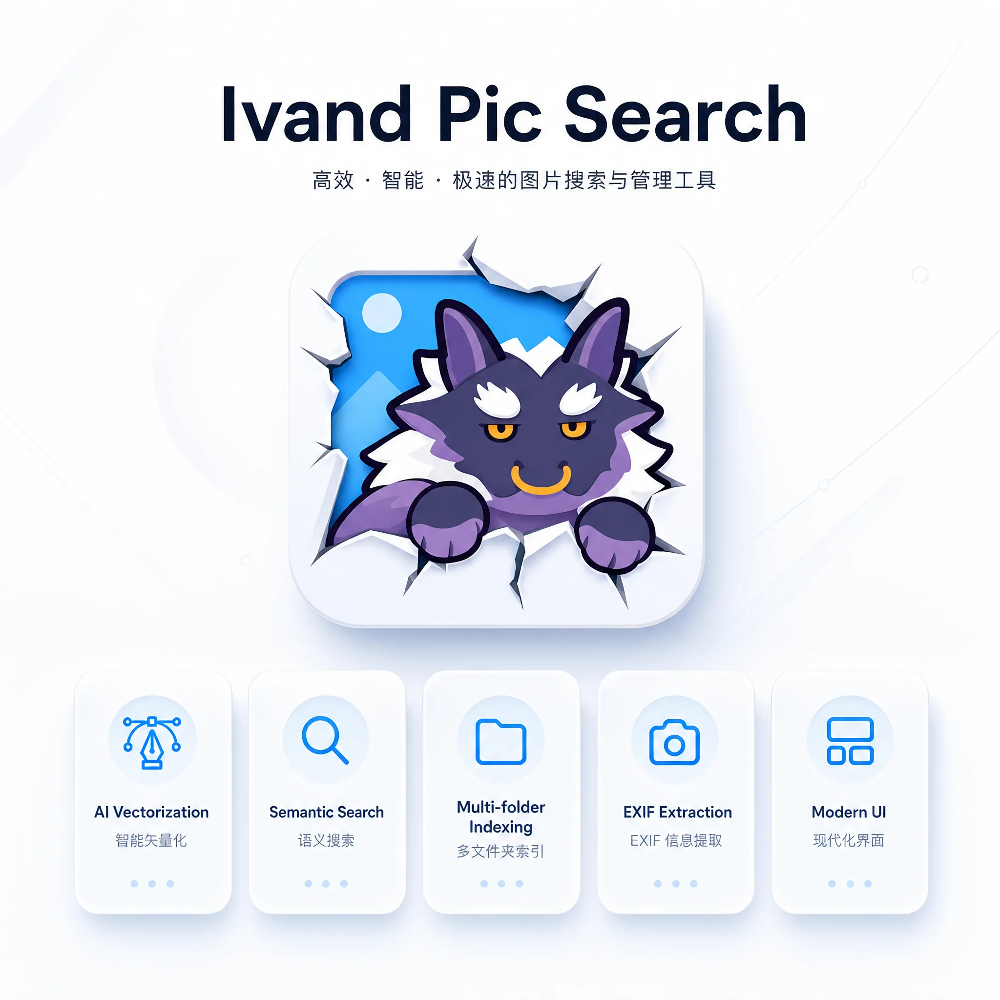

# 🖼️ 魔王图片搜索




基于 AI 向量化技术的本地图片搜索引擎，支持语义搜索、EXIF 信息提取、智能缩略图生成等功能。使用 NeutralinoJS + Vue3 + Rust 构建的跨平台桌面应用。

> **开发说明**：本项目开发者主要使用 Windows，以下说明均基于 Windows 系统。其他系统如有需要可提供有限支持。

## ✨ 核心特性

- 🔍 **语义搜索** - 使用 AI 向量嵌入技术，支持自然语言搜索图片
- 📁 **多文件夹索引** - 支持索引多个本地文件夹中的图片和文本文件
- 🖼️ **智能缩略图** - 自动生成缩略图，支持 HEIC/HEIF 格式转换
- 📊 **EXIF 信息提取** - 自动提取并显示图片的拍摄信息（相机、ISO、光圈等）
- 🗂️ **索引管理** - 查看、查询、删除已索引的文件记录
- 🎨 **现代化 UI** - 基于 Naive UI 的简洁美观界面
- 💾 **本地存储** - 所有数据存储在本地，保护隐私
- ⚡ **高性能** - Rust 后端提供强大的处理能力

## 📦 使用发布版本

下载 release 版本后，解压文件夹，双击 `localimagesearch.exe` 即可运行。

> 💡 **提示**: 无需安装任何开发环境，直接运行即可使用。

## 📖 使用指南

### 首次使用

1. **配置 AI 服务**
   - 进入"设置"页面
   - 选择 AI 提供商（OpenAI 兼容 / 自定义 API）
   - 填写 API 端点、密钥和模型名称
   - 点击"测试连接"验证配置

2. **添加搜索文件夹**
   - 进入"索引"页面
   - 点击"选择文件夹"添加要索引的目录
   - 支持添加多个文件夹

3. **构建索引**
   - 点击"开始索引"
   - 等待索引完成（会显示进度）
   - 索引完成后即可搜索

4. **开始搜索**
   - 进入"搜索"页面
   - 输入自然语言描述
   - 查看搜索结果和缩略图

### 支持的图片格式

- JPEG (.jpg, .jpeg)
- PNG (.png)
- GIF (.gif)
- BMP (.bmp)
- WebP (.webp)
- HEIC/HEIF (.heic, .heif) - 自动转换为 WebP

### 支持的文本格式

- 纯文本 (.txt)
- Markdown (.md)

## 🔌 Embedding API 协议

应用使用 **vLLM Chat Embeddings 扩展协议** 调用嵌入 API。详细的请求/返回格式说明请参阅 [Embedding API 协议说明](api-protocol.md)。

##  故障排除

### 常见问题

#### 1. NeutralinoJS 无法启动

```bash
# 确保已安装依赖
pnpm install

# 检查 NeutralinoJS CLI 版本
pnpm neu --version

# 重新初始化
rm -rf .neutralino
pnpm neu:dev
```

#### 2. AI API 连接失败

- 检查网络连接
- 验证 API 端点和密钥
- 确认模型名称正确
- 使用"测试连接"功能验证配置

## 📝 更多信息

- **[开发者说明](DEVELOPER.md)** — 架构说明、数据库设计、开发指南、构建部署
- **[vLLM 部署指南](vllm-deployment.md)** — 如何部署 vLLM 以提供嵌入 API 服务

## 📄 许可证

本项目采用 MIT 许可证。
